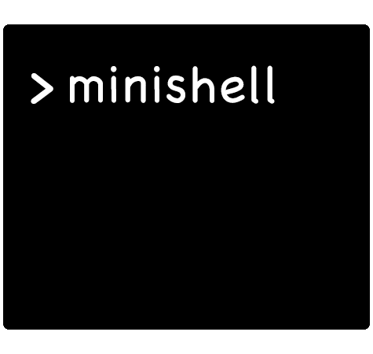

	

## mrhyhorn and sshield group 👩🏻‍💻 🧑🏻‍💻 at School21

	

## 📄 Summary

The aim of this project is to implement our own shell with limited functionality (it's mini).

## 📝 Project description

 

Requirements

The shell should:

- Display a prompt when waiting for a new command.

- Have a working history.

- Search and launch the right executable (based on the PATH variable or using a relative or an absolute path).

- Not use more than one global variable. Think about it. You will have to explain its purpose.

- Not interpret unclosed quotes or special characters which are not required by the subject such as \ (backslash) or ; (semicolon).

- Handle <code>’</code> (single quote) which should prevent the shell from interpreting the metacharacters in the quoted sequence.

- Handle <code>"</code> (double quote) which should prevent the shell from interpreting the metacharacters in the quoted sequence except for $ (dollar sign).

- Implement redirections:
	- <code> < </code> should redirect input.
	- <code> > </code> should redirect output.
	- <code> << </code> should be given a delimiter, then read the input until a line containing the delimiter is seen.
	- <code> >> </code> should redirect output in append mode.

- Implement pipes (<code>|</code> character). The output of each command in the pipeline is connected to the input of the next command via a pipe.

- Handle environment variables (<code>$</code> followed by a sequence of characters) which should expand to their values.

- Handle <code>$?</code> which should expand to the exit status of the most recently executed foreground pipeline.

- Handle ctrl-C, ctrl-D and ctrl-\ which should behave like in bash.

- In interactive mode:
	- ctrl-C displays a new prompt on a new line.
	- ctrl-D exits the shell.
	- ctrl-\ does nothing.

- Your shell must implement the following builtins:
	- <code>echo</code> with option -n
	- <code>cd</code> with only a relative or absolute path
	- <code>pwd</code> with no options
	- <code>export</code> with no options
	- <code>unset</code> with no options
	- <code>env</code> with no options or arguments
	- <code>exit</code> with no options

## 🛠 Tests

• Signals

After pressing CTRL-C <code>echo $?</code> should display exit status 1

• Check fd’s leaks / проверить незакрытые fd (файловые дескрипторы)

	ls -l /proc/<pid>/fd

	lsof -p <pid>
	#or
	lsof -c <executable>

• Redirections

	ls -l -a -p > file > file2 > file3

	# redirections can precede or follow the command
	< file1 < file2 wc -l < file3 > outfile >> outfile1 >> outfile2

	# wc should read from last heredoc end3
	cat -e << lim | wc -l << end < infile << end2 < infile1 << end3

	# out2 shouldn't be created
	cat -e > out > out1 > no_permission > out2

• Pipes

	ls -l -a -p | awk '{print $1}' | cat -e

	cat /dev/random | head -c 100 | wc -c

	yes | head -c 100 | cat -e > out

	time -p sleep 3 | echo toto
	

many pipes

	echo test | cat -e | cat -e | cat -e | cat -e | cat -e | cat -e | cat -e | cat -e | cat -e | cat -e| cat -e| cat -e| cat -e| cat -e| cat -e| cat -e| cat -e| cat -e|cat -e|cat -e|cat -e|cat -e|cat -e|cat -e|cat -e|cat -e|cat -e|cat -e|cat -e|cat -e|cat -e|cat -e|cat -e|cat -e|cat -e|cat -e|cat -e|cat -e|cat -e|cat -e|cat -e|cat -e|cat -e|cat -e|cat -e|cat -e|cat -e|cat -e|cat -e|cat -e|cat -e|cat -e|cat -e|cat -e|cat -e|cat -e|cat -e|cat -e|cat -e|cat -e|cat -e|cat -e|cat -e|cat -e|cat -e|cat -e|cat -e|cat -e|cat -e|cat -e|cat -e|cat -e|cat -e|cat -e|cat -e|cat -e|cat -e|cat -e|cat -e|cat -e|cat -e|cat -e|cat -e|cat -e|cat -e|cat -e|cat -e|cat -e|cat -e|cat -e|cat -e|cat -e|cat -e|cat -e|cat -e|cat -e|cat -e|cat -e|cat -e|cat -e|cat -e|cat -e|cat -e|cat -e|cat -e|cat -e|cat -e|cat -e|cat -e|cat -e|cat -e|cat -e|cat -e|cat -e|cat -e|cat -e|cat -e|cat -e|cat -e|cat -e|cat -e|cat -e|cat -e|cat -e|cat -e|cat -e|cat -e|cat -e|cat -e|cat -e|cat -e|cat -e|cat -e|cat -e|cat -e|cat -e|cat -e|cat -e|cat -e|cat -e|cat -e|cat -e|cat -e|cat -e|cat -e|cat -e|cat -e|cat -e|cat -e|cat -e|cat -e|cat -e|cat -e|cat -e|cat -e|cat -e|cat -e|cat -e|cat -e|cat -e|cat -e|cat -e|cat -e|cat -e|cat -e|cat -e|cat -e|cat -e|cat -e|cat -e|cat -e|cat -e|cat -e|cat -e|cat -e|cat -e|cat -e|cat -e|cat -e|cat -e|cat -e|cat -e|cat -e|cat -e|cat -e|cat -e|cat -e|cat -e|cat -e|cat -e|cat -e|cat -e|cat -e|cat -e|cat -e|cat -e|cat -e|cat -e|cat -e|cat -e|cat -e|cat -e|cat -e|cat -e|cat -e|cat -e|cat -e|cat -e|cat -e|cat -e|cat -e|cat -e|cat -e|cat -e|cat -e|cat -e|cat -e|cat -e|cat -e|cat -e|cat -e|cat -e|cat -e|cat -e|cat -e|cat -e|cat -e|cat -e|cat -e|cat -e|cat -e|cat -e|cat -e|cat -e|cat -e|cat -e|cat -e|cat -e|cat -e|cat -e|cat -e|cat -e|cat -e|cat -e|cat -e|cat -e|cat -e|cat -e|cat -e|cat -e|cat -e|cat -e|cat -e|cat -e|cat -e|cat -e|cat -e|cat -e|cat -e|cat -e|cat -e|cat -e|cat -e|cat -e|cat -e|cat -e|cat -e|cat -e|cat -e|cat -e|cat -e|cat -e|cat -e|cat -e|cat -e|cat -e|cat -e|cat -e|cat -e|cat -e|cat -e|cat -e|cat -e|cat -e|cat -e|cat -e|cat -e|cat -e|cat -e|cat -e|cat -e|cat -e|cat -e|cat -e|cat -e|cat -e|cat -e|cat -e|cat -e|cat -e|cat -e|cat -e|cat -e|cat -e|cat -e|cat -e|cat -e|cat -e|cat -e|cat -e|cat -e|cat -e|cat -e|cat -e|cat -e|cat -e|cat -e|cat -e|cat -e|cat -e|cat -e|cat -e|cat -e|cat -e|cat -e|cat -e|cat -e|cat -e|cat -e|cat -e|cat -e|cat -e|cat -e|cat -e|cat -e|cat -e|cat -e|cat -e|cat -e|cat -e|cat -e|cat -e|cat -e|cat -e|cat -e|cat -e|cat -e|cat -e|cat -e|cat -e|cat -e|cat -e|cat -e|cat -e|cat -e|cat -e|cat -e|cat -e|cat -e|cat -e > out

• Echo

	[minishell]->  echo -nnnnnnnnnnn -n -n -n -n -n -n -n -nnnnnnnl TOTO
	-nnnnnnnl TOTO[minishell]->

	[minishell]-> $? + $?
	minishell: 0: command not found
	[minishell]-> echo $? + $?
	127 + 127

• cd

	[minishell]-> export HOME="MY_HOME"
	[minishell]-> export
	declare -x COLORFGBG="15;0"
	declare -x COLORTERM="truecolor"
	declare -x HOME="MY_HOME"
	[minishell]-> cd ~
	bash: cd: MY_HOME: No such file or directory
